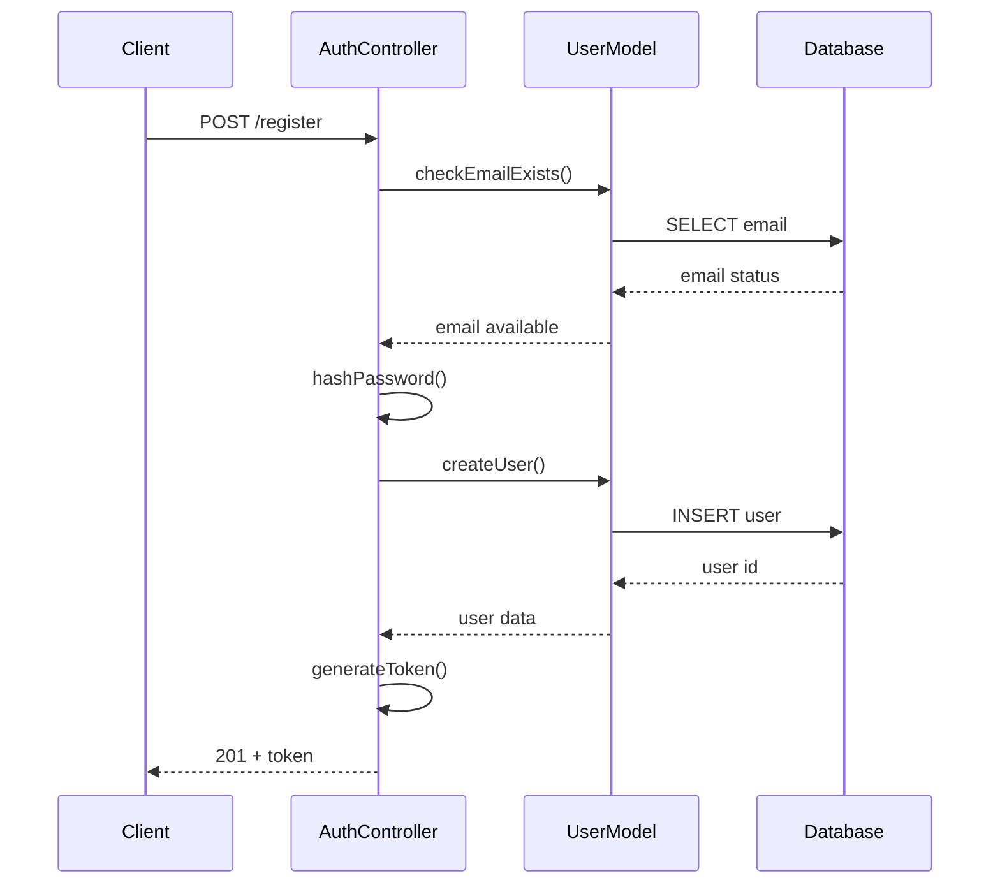

# Authentication Module Specification

## Overview
Handles user registration, login, logout, and session management. Covers KPIs 1-6.

## Endpoints

### 1. POST `/api/auth/register`
**Request Body:**
```json
{
  "email": "user@example.com",
  "password": "securepassword123"
}
```

**Response (Success - 201):**
```json
{
  "message": "User registered successfully",
  "user": {
    "id": 1,
    "email": "user@example.com"
  },
  "token": "jwt_token_here"
}
```

**Validation Rules:**
- Email must be valid and unique
- Password minimum 8 characters
- Email max 255 characters

### 2. POST `/api/auth/login`
**Request Body:**
```json
{
  "email": "user@example.com",
  "password": "securepassword123"
}
```

**Response (Success - 200):**
```json
{
  "message": "Login successful",
  "user": {
    "id": 1,
    "email": "user@example.com"
  },
  "token": "jwt_token_here"
}
```

**Error Responses:**
- 401: Invalid credentials
- 404: User not found

### 3. POST `/api/auth/logout`
**Headers:**
```
Authorization: Bearer <token>
```

**Response (Success - 200):**
```json
{
  "message": "Logged out successfully"
}
```

## Implementation Details

### Password Hashing
- Use bcrypt with salt rounds 10
- Store only hash in database (KPI 6)
- Never store plaintext passwords

### JWT Token Generation
```javascript
const jwt = require('jsonwebtoken');

function generateToken(userId, email) {
  return jwt.sign(
    { userId, email },
    process.env.JWT_SECRET,
    { expiresIn: process.env.JWT_EXPIRY || '24h' }
  );
}
```

### Session Persistence (KPI 4)
- Store token in HTTP-only cookie or localStorage
- Implement token refresh mechanism
- Validate token on protected routes

### Auth Middleware
```javascript
const jwt = require('jsonwebtoken');

function authMiddleware(req, res, next) {
  const token = req.header('Authorization')?.replace('Bearer ', '');
  
  if (!token) {
    return res.status(401).json({ error: 'Access denied. No token provided.' });
  }

  try {
    const decoded = jwt.verify(token, process.env.JWT_SECRET);
    req.user = decoded;
    next();
  } catch (error) {
    res.status(401).json({ error: 'Invalid token.' });
  }
}
```

## Database Operations

### User Model Methods
```javascript
class User {
  static async findByEmail(email) {
    // Query database for user by email
  }

  static async create(email, passwordHash) {
    // Insert new user with hashed password
  }

  static async verifyPassword(plainPassword, hashedPassword) {
    return bcrypt.compare(plainPassword, hashedPassword);
  }
}
```

## KPI Coverage

### KPI 1: User Registration
- Implement `/api/auth/register` endpoint
- Validate email uniqueness
- Hash password before storage
- Return success response

### KPI 2: Successful Login
- Implement `/api/auth/login` endpoint
- Verify credentials against database
- Generate JWT token
- Return user data and token

### KPI 3: Invalid Login Rejection
- Return 401 for wrong password
- Return 404 for non-existent email
- Provide appropriate error messages

### KPI 4: Session Persistence
- Store token in secure storage
- Implement token validation middleware
- Handle token refresh

### KPI 5: Logout Functionality
- Implement `/api/auth/logout` endpoint
- Clear token from client storage
- Invalidate token if using blacklist

### KPI 6: Password Hashing
- Use bcrypt for password hashing
- Never store plaintext passwords
- Verify hash in database inspection

## Security Considerations

### 1. Input Validation
- Sanitize email and password inputs
- Prevent SQL injection with parameterized queries
- Validate email format

### 2. Token Security
- Use HTTP-only cookies for token storage
- Implement CSRF protection
- Set appropriate token expiration

### 3. Rate Limiting
- Implement rate limiting for login attempts
- Prevent brute force attacks
- Log failed login attempts

## Testing Requirements

### Unit Tests
1. Test password hashing and verification
2. Test JWT token generation and validation
3. Test email validation logic
4. Test error handling for invalid inputs

### Integration Tests
1. Test complete registration flow
2. Test login with valid/invalid credentials
3. Test protected route access
4. Test logout functionality

## File Structure
```
src/
├── controllers/
│   └── authController.js
├── middleware/
│   └── authMiddleware.js
├── models/
│   └── User.js
├── routes/
│   └── authRoutes.js
├── services/
│   └── authService.js
└── utils/
    └── validators.js
```

## Sequence Diagram


## Dependencies
- bcrypt: Password hashing
- jsonwebtoken: Token generation/validation
- express-validator: Input validation
- oracledb: Database operations